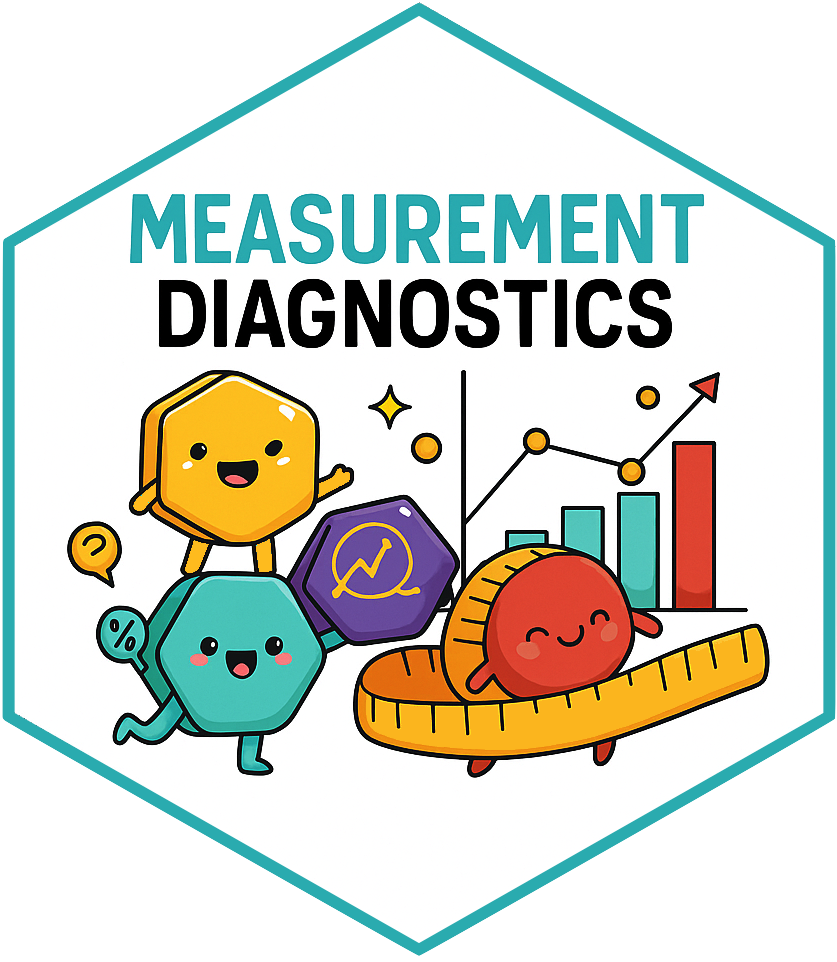

<!-- README.md is generated from README.Rmd. Please edit that file -->

```{r, include = FALSE}
knitr::opts_chunk$set(
  collapse = TRUE,
  comment = "#>",
  fig.path = "man/figures/README-",
  out.width = "100%", 
  message = FALSE, 
  warning = FALSE
)
```

<!-- README.md is generated from README.Rmd. Please edit that file -->
# MeasurementDiagnostics 

<!-- badges: start -->
[](https://CRAN.R-project.org/package=MeasurementDiagnostics)
[](https://github.com/OHDSI/MeasurementDiagnostics/actions/workflows/R-CMD-check.yaml)
[](https://app.codecov.io/gh/OHDSI/MeasurementDiagnostics)
[](https://lifecycle.r-lib.org/articles/stages.html#experimental)

<!-- badges: end -->

The MeasurementDiagnostics package provides tools to assess how measurements are recorded and used in data mapped to the OMOP Common Data Model (CDM). 

Diagnostics can be run either on the full dataset or restricted to a specific cohort, helping users better understand data completeness, frequency, and value distributions for measurements of interest.

## Installation

The package can be installed from CRAN:

```{r, eval = FALSE}
install.packages("MeasurementDiagnostics")
```

Or you can install the development version of the package from GitHub:

```{r, eval = FALSE}
# install.packages("devtools")
devtools::install_github("ohdsi/MeasurementDiagnostics")
```


## Example

Suppose you are conducting a study that relies on measurements of respiratory function. Before using these measurements analytically, you may want to understand how frequently they are recorded, how values are stored, and whether they vary across subgroups. MeasurementDiagnostics can be used to explore these aspects.

For this example we'll use the GiBleed mock data. 

```{r, warning=FALSE}
library(omock)
library(MeasurementDiagnostics)
library(OmopViewer)
```

```{r, message=TRUE}
cdm <- mockCdmFromDataset(datasetName = "GiBleed")
cdm
```

Now we have a cdm reference with our data, we will create a codelist with measurement concepts.
```{r}
respiratory_function_codes <- list("respiratory_function" = c(4052083L, 4133840L, 3011505L))
```

And now we can run all measurement diagnostic checks, stratifying results by sex.
```{r}
respiratory_function_measurements <- summariseMeasurementUse(
  cdm = cdm, codes = respiratory_function_codes, bySex = TRUE
)
```

The results include three main components:

1) A summary of measurement use, including the number of subjects with measurements, the number of measurements per subject, and the time between measurements.

2) A summary of measurement values recorded as numeric.

3) A summary of measurement values recorded using concepts.

### Visualise results: Tables

Tabular summaries can be produced using the corresponding table functions. For example, the following tables display summaries of numeric values and concept-based values:

```{r}
tableMeasurementValueAsConcept(respiratory_function_measurements)
```

```{r}
tableMeasurementValueAsNumber(respiratory_function_measurements)
```


### Visualise results: Plots

Each diagnostic result can also be visualised using plotting functions. For instance, the time between measurements can be displayed using boxplots:

```{r}
respiratory_function_measurements |>
  plotMeasurementSummary( 
    colour = "sex", 
    facet = NULL
  )
```

## Visualise results: Shiny App

The package `OmopViewer` supports `MeasurementDiagnostics` results and provides a user-friendly way of quickly get a shiny app to visualise these results.

```{r, eval=FALSE}
exportStaticApp(result = respiratory_function_measurements, directory = tempdir())
```
